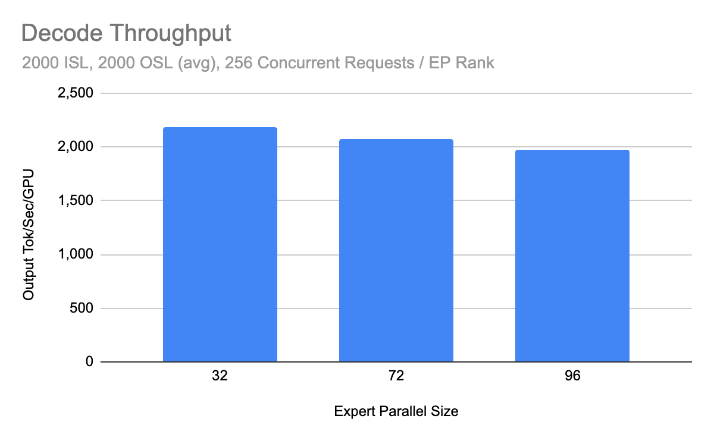
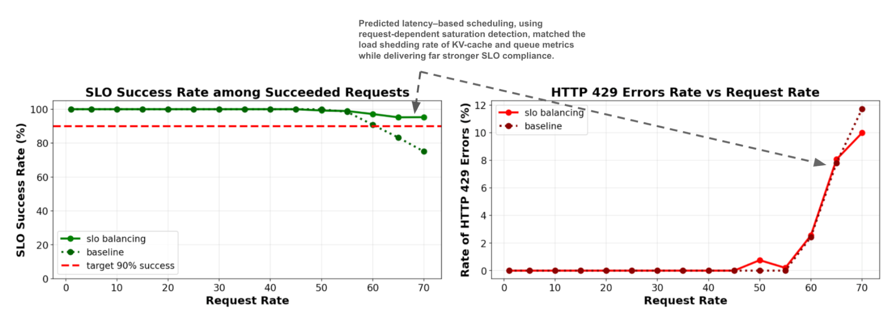
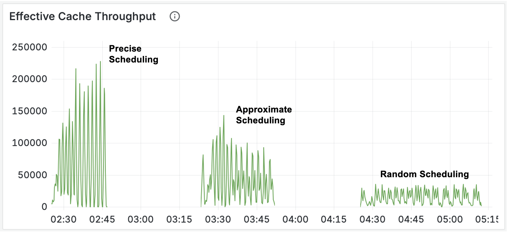

# llm-d 0.3: Wider Well-Lit Paths for Scalable Inference

In our [0.2 release](https://llm-d.ai/blog/llm-d-v0.2-our-first-well-lit-paths), we introduced the first *well-lit paths*, tested blueprints for scaling inference on Kubernetes. With 0.3 release, we double down on the mission: to provide a fast path to deploying high performance, hardware-agnostic, easy to operationalize, at scale inference.

This release delivers:

* Expanded hardware support, now including Google TPU and Intel support
* TCP and RDMA over RoCE validated for disaggregation
* A predicted latency based balancing preview that improves P90 latency by up to 3x in long-prefill workloads
* Wide expert parallel (EP) scaling to 2.2k tokens per second per H200 GPU
* The GA release of the Inference Gateway (IGW v1.0).

Taken together, these results redefine the operating envelope for inference. llm-d enables clusters to run hotter before scaling out, extracting more value from each GPU, and still meet strict latency objectives. The result is a control plane built not just for speed, but for predictable, cost-efficient scale.

<!-- truncate -->

## **Commit to the Mission**

llm-d’s mission is to be a hardware-agnostic, upstream-aligned control plane for inference. 0.3 takes a decisive step forward, not only by expanding platform coverage, but also by making it easier to adopt and experiment with.

### **Broader Hardware Support** 

llm-d support spans now across an expanded array of accelerator families: NVIDIA, Google TPU, and Intel XPU. TPU artifacts are tested in cloud environments and Intel XPU builds run through CI runners alongside NVIDIA.

Disaggregation support is now more portable. With 0.3, TCP and RDMA over RoCE have been validated as transports for prefill/decode separation. This extends disaggregation beyond specialized InfiniBand fabrics, opening the path to reproducible deployments in mainstream cloud networking environments.

### **Simplified User Experience Across A Variety of Infrastructure**

Serving large language models is complex \-  our documentation and configuration should be simple. Quickstarts have been streamlined and renamed to guides, with fewer options and more context around the key decisions you need to make. They are now located in the main repository and treated as living documents alongside our growing documentation for common scenarios.  Since llm-d is about exposing the key tradeoffs and exposing useful patterns, we’ve split out the key prerequisites for each guide \- cluster configuration, client setup, and gateway choice \- into their own sections, and replaced our all-in-one installer scripts with better step by step instructions.

As more cluster providers integrate into llm-d we’ve expanded the documentation for infrastructure with provider specific troubleshooting, configuration, and testing. This release adds documentation and steps for CoreWeave, Digital Ocean, Google Kubernetes Engine, and OpenShift.

Guides now include curated Inference Gateway installs and static manifests for clarity, with overlays available for benchmarking sweeps. RBAC patterns were refactored toward namespace scope for smoother multi-tenancy.

**Why it matters:** With 0.3, experimenting with intelligent scheduling or disaggregation is as simple as running a documented guide. The control plane is more transparent, reproducible, and extensible, independently of the platform you are running. 

## **Brighten the well-lit paths**

The well-lit paths we introduced in 0.2 - wide-EP, intelligent scheduling, disaggregation - are now sharper and more reproducible.

### **Wide-EP Performance**

The wide-EP path, which parallelizes across experts to maximize throughput, has reached **2.2k tokens/s per H200 GPU** in community benchmarks on H200 clusters.

The result reflects sustained throughput in multi-node deployments with production-like settings. Earlier results hovered around 1.5k tokens/s per GPU; the jump to 2.2k confirms that kernel optimizations (silu-mul-quant fusion, Cutlass QKV kernels, TP attention bugfixes) and the addition of Dual Batch Overlap (DBO) for decode are delivering compound gains.

**Why it matters:** At these throughput levels operators can consolidate workloads onto fewer nodes, reduce the number of replicas needed for a given QPS, and lower token-per-dollar cost.

### **Inference Gateway v1.0 GA**

In v0.2, we brought a number of new features to the inference scheduling space. With v0.3, the Inference Gateway (IGW) reaches v1.0 GA, making intelligent routing a stable primitive in llm-d.

  
*Figure: A tri-panel of TTFT, TPoT and Throughput measured through progressively rising QPS rates, comparing scheduling that is load- vs prefix- vs prefix+load- aware scheduling*. *Check out our blog [KV-Cache Wins You Can See](https://llm-d.ai/blog/kvcache-wins-you-can-see#performance-results) for more details.*

IGW integrates tightly with the llm-d scheduler, supporting load (kv-cache utilization and queue length) and prefix-cache aware scheduling. Benchmarks show that adding prefix aware scorers achieve near-100% KV cache hit rates and significantly reduce TTFT compared to earlier routing approaches based on load only. For cluster-level throughput, that means sustained \>60k tokens/s with lower latency spread. It also demonstrates the importance of combining prefix and load-aware scorers to ensure that cache hits are exploited without overloading replicas.

**Why it matters:** This is the difference between inference systems that react to congestion and ones that proactively route requests to where cache reuse and concurrency balance are best. For operators it translates into fewer cache misses, reduced latency spikes, and predictable scaling.

### **Predicted Latency-Based Scheduling**

We are introducing an innovative experimental scheduling scorer designed to optimize latency. This predictor incorporates input length, in-flight tokens, and concurrency into a unified cost model to forecast TTFT and TPOT for each request across available servers. The system proactively balances requests within the 25–75% saturation window, where most clusters operate and where reactive schedulers fall short.

*Figure:  TTFT and TPOT tail latency measured on increasing QPS rates (6 servers), comparing predicted-latency with prefix+load aware scheduling for a 4:1 ISL:OSL ratio.*

The first graph demonstrates that the new scorer slightly enhances tail latency when handling a balanced ISL:OSL workload. Another major advantage it offers over manually tuned load and prefix-aware scorers is simplifying configuration by automatically learning thresholds from ingested features. This inherent adaptability makes it more resilient to shifts in traffic patterns and allows for easier integration of new scheduling signals.

The subsequent figure illustrates that as the workload shifts towards a more prefill-intensive distribution, the new scorer offers even better performance. This is because it more precisely predicts prefill duration, which is tied to a known request length, in contrast to decode time, which depends on an unpredictable output length.

*Figure:  TTFT and TPOT tail latency measured on increasing QPS rates (6 servers), comparing predicted-latency with prefix+load aware scheduling for a 400:1 ISL:OSL ratio.*

With better prediction of latency the new approach also enhances SLO attainability for sheddable workloads by more effectively detecting saturation before it occurs rather than after.

*Figure: SLO attainability (1 server), comparing predicted-latency with load-aware scheduling and shedding for a balanced \~1:1 ISL:OSL ratio.*

**Why it matters:**

* Users experience steadier, lower tail latencies: critical for interactive workloads.  
* Operators can push GPUs closer to saturation before scaling out, reducing cost.  
* SLOs evolve from reactive guardrails to proactive dials for tuning responsiveness vs. stability.  
* This lays the foundation for closed-loop autoscaling that responds directly to SLO objectives.

For MaaS providers, these gains are not just academic, they directly translate into lower variance for customers and better utilization of costly accelerators.

### **KV Disaggregation and Chat Completions**

The KV path also matures in v0.3. Synchronous tokenization has stabilized efficient caching in high-availability deployments, while precise prefix-cache aware scorers achieve significantly reduced KV-cache duplication across instances and limits the impact of prefix cache expiration pressure, significantly reducing TTFT (x57 in [our benchmark](https://llm-d.ai/blog/kvcache-wins-you-can-see)) and doubling throughput. 

The benchmark simulates a B2B SaaS platform serving 150 enterprise customers, each with their own 6,000-token context shared among 5 concurrent users (750 total) under sustained load, where cache demand exceeds single-instance capacity and forces distributed scheduling \- testing the system's ability to avoid cache thrashing.  
  
*Figure: A tri-panel of TTFT, TPoT and Throughput measured through progressively rising QPS rates in a [demanding benchmark](https://llm-d.ai/blog/kvcache-wins-you-can-see#performance-results).* 

**  
*Figure: The total computational work \- tokens per second \- **saved** by effective KV-cache use across the cluster, over the course of the [benchmarks](https://llm-d.ai/blog/kvcache-wins-you-can-see#1-effective-cache-throughput-quantifying-saved-work).*

**Why it matters:** The stronger cache affinity guarantees provided by precise prefix-cache aware routing keep latency low without requiring the use of coarse-grained sticky sessions or high operational overhead. Real-world chat completion workloads can keep the high cache hit rates of sticky sessions but gain utilization based balancing, reducing hot spotting and underutilized capacity.

### **Observability and Benchmarking**

Behind these performance and scheduling gains is a stronger foundation for visibility and reproducibility.

* **Observability**: Gateway metrics are now exposed via ServiceMonitor, with PromQL queries and Grafana dashboards published in the docs.  
* **Benchmarking**: v0.30 RC1 supports all well-lit path scenarios in CI/CD. Inference-perf has been hardened with saturation testing, trace replay, and more accurate scheduling.

**Why it matters:** operators can now validate configs before launch, monitor latency compliance in real time, and detect regressions early. This ensures the well-lit paths are not just concepts, but reproducible and production-ready.

## **What Do You Get Today?**

With v0.3, here’s what you can run, experiment with, and rely on:

* Cross-platform hardware support across NVIDIA, Intel XPU, and Google TPU.  
* Simplified installation with curated guides, overlays, static manifests, and a capacity planner.  
* Wide-EP throughput (reaching 2.2k tokens/s per GPU on multi-node H200 clusters).  
* Inference Gateway v1.0 GA, with cache-aware routing and stable APIs.  
* Adaptive SLO predictor (preview) showing up to 3x better P90 latency in long-prefill workloads.  
* KV disaggregation with synchronous tokenization, precise scorers, and chat completions support.  
* Disaggregation over TCP and RDMA/RoCE, extending beyond InfiniBand networks.  
* Observability tools with ServiceMonitor and Grafana dashboards.

## **What Is Next?**

While v0.3 stabilizes today’s well-lit paths, the community is also laying the foundations for tomorrow’s paths

* **Native CPU offload in vLLM**: Async KV transfer APIs and CPU buffer transport under review, enabling cache spillover to CPU memory with scheduler awareness through KV events.  
* **Deferred decode and async protocols**: design work underway for finer scheduling control and a lower level “tokens in / tokens out” serving engine in vLLM for high scale multi-modal serving  
* **Public performance database**: building on benchmarking harnesses to provide transparent, reproducible performance data across platforms.  
* **Autoscaling incubation**: WVA autoscaler integrated with Kubernetes HPA; demonstrated scale-to-zero. Next steps include tying autoscaler decisions directly to adaptive SLOs.

If there is an area you’d like for us to focus on, please suggest it in our [0.4 release tracking issue.](https://github.com/llm-d/llm-d/issues/347)

## **Community and Upcoming Events**

The strength of llm-d comes from its community. v0.3 reflects contributions from a growing number of contributors and collaborators.  Thank you to everyone who helped out\!

Upcoming highlights include llm-d sessions, All Things Open (Oct 12–14, 2025), PyTorch Conference (Oct 22–23, 2025), AMD AI DevDay (Oct 20), and Kubecon 2025 (Nov 10-14). You can follow these and other events on our [community events page](https://llm-d.ai/docs/community/events).

Contribute on [GitHub](https://github.com/llm-d), [join our community calls](https://red.ht/llm-d-public-calendar) (Wed 12:30pm ET), join the SIGs and come build with us\!
