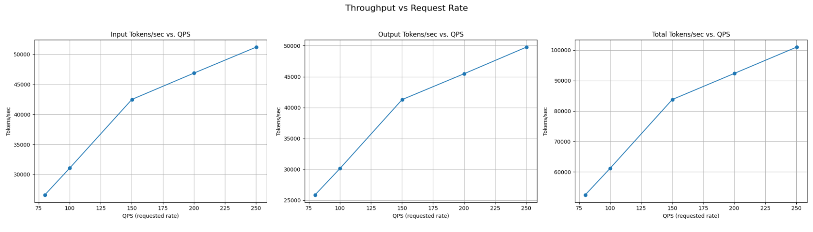
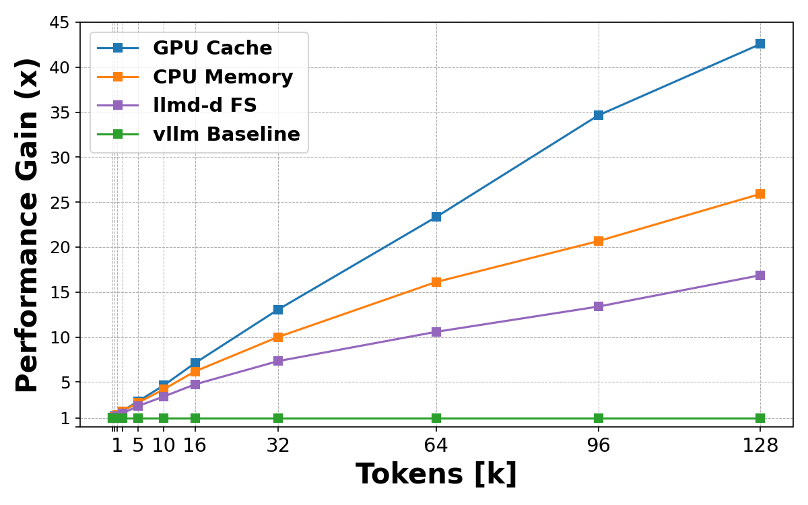
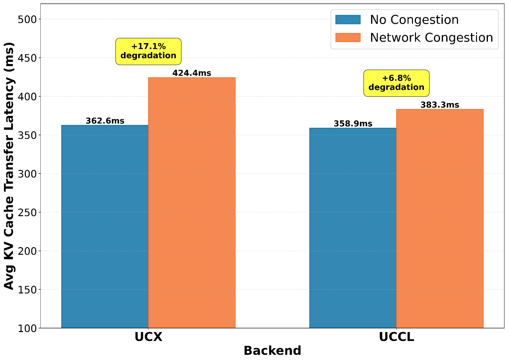

# llm-d 0.5: Reproducible, resilient, and cost-efficient inference at scale

In our previous release ([v0.4](/blog/llm-d-v0.4-achieve-sota-inference-across-accelerators)), we focused on minimizing latency for critical workloads, introducing speculative decoding and extending disaggregated serving to new accelerator architectures. The v0.5 release of llm-d expands our focus from feature breadth to the operational rigor required for large-scale production. This iteration prioritizes the stability, reproducibility, and cost-efficiency of those workflows. 

Sustaining SoTA at scale demands reproducibility in benchmarking, resilience against network noise, and efficient resource utilization during idle periods. This release delivers concrete progress across each of these dimensions. 

This release improves the platform across five critical dimensions:

1. **Developer Experience and reproducibility:** We have simplified the benchmarking workflow with dedicated, in-guide benchmark support, allowing users to validate each “well-lit path” with a single command.  
2. **Hierarchical KV Offloading:** A new storage architecture decouples cache capacity from GPU memory through native CPU and filesystem tiers.  
3. **Advanced Scheduling:** Cache-aware routing now supports LoRA adapters and active-active high availability.  
4. **Resilient Networking:** A new transport backend (UCCL) improves stability in congested networks.  
5. **Autoscaling Updates:** We have introduced scale-to-zero capabilities for cost-efficient intermittent workloads.

<!-- truncate -->

