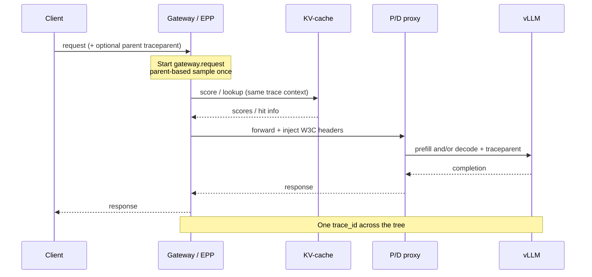

# Seeing Through the Stack: End-to-End and Fine-Grained Tracing in llm-d

Production llm-d deployments usually already expose Prometheus metrics, GPU utilization, and latency histograms. Those signals answer *whether* the fleet is healthy. They rarely answer the question that dominates incident response and optimization work:

> *For this slow or failed request, which hop decided what, and where did the time actually go?*

That gap is structural. llm-d’s value sits in control-plane decisions — precise prefix-cache scoring, load-aware selection, prefill/decode (P/D) disaggregation, multi-hop proxies. Fleet aggregates cannot reconstruct those decisions after the fact. Distributed tracing can.

This post walks through two complementary capabilities now available across the llm-d stack:

1. **End-to-end (E2E) distributed tracing** — one `trace_id` across Gateway → EPP → KV-cache → P/D proxy → vLLM  
2. **Fine-grained tracing** — first-party spans at the decision points that make well-lit paths real

Together they move observability from “the cluster looks busy” to “this request chose this pod for this cache score, ran prefill here, and spent 15ms to first token on decode.”

<!-- truncate -->

:::tip Blog key takeaways

- **Metrics detect; traces explain.** Prometheus/Grafana remain the detection and capacity plane; OpenTelemetry traces are the request-level causal spine for RCA and optimization validation.
- **E2E tracing** propagates W3C Trace Context (`traceparent` / `tracestate`) so Gateway, EPP, KV-cache, P/D proxy, and vLLM share one tree — not four orphan timelines.
- **Fine-grained tracing** manually instruments llm-d decisions (prefix-cache scoring, KV index lookup, P/D profile pick, proxy stages) that HTTP auto-instrumentation cannot name.
- **Telemetry is metadata-only:** token counts, latencies, routing attributes, cache ratios — never prompts or completions.
- **Production defaults:** parent-based sampling (often ~10%), an OpenTelemetry Collector in the middle, and GenAI semantic conventions where engines emit them.

:::

<div style={{textAlign: 'center', margin: '24px 0'}}>
  
  <p style={{textAlign: 'center', fontSize: '0.9em', marginTop: '8px'}}><em><strong>FIGURE 1</strong>: Metrics, traces, and logs answer different questions. This post focuses on traces as the request spine.</em></p>
</div>

## Why LLM inference breaks classical “just add APM” advice

Kubernetes-era APM habits assume relatively uniform microservices: short RPCs, similar cost per call, cheap retries. Distributed LLM inference violates those assumptions in ways that change what must be instrumented:

| Classical microservice | Distributed LLM inference (llm-d) |
| :--- | :--- |
| Request cost is roughly similar | Prefill vs decode, prompt length, and cache hit rate swing cost by orders of magnitude |
| Stateless replicas are interchangeable | KV-cache locality makes pods *not* interchangeable |
| Latency is “service time + queue” | Latency is admission + scoring + optional P/D coordination + engine phases |
| One hop failure is obvious | Failure can surface far from the decision that caused it |
| Auto-instrumented HTTP spans are enough | The important story is *inside* the scheduler and cache index |

llm-d already invests heavily in making those control-plane decisions correct — see [Intelligent Inference Scheduling](/blog/intelligent-inference-scheduling-with-llm-d) and [KV-Cache Wins You Can See](/blog/kvcache-wins-you-can-see). Observability has to keep pace: if a precise prefix-cache win or a P/D mis-decision cannot be inspected on a real request, those paths cannot be operated or improved with confidence.

From an observability design standpoint, that means tracing is a first-class well-lit-path concern — configuration, sampling, span contracts, and backend wiring — not an optional debug switch flipped after an outage.

## Design goals for llm-d tracing

The [distributed tracing proposal](https://github.com/llm-d/llm-d/blob/main/proposals/distributed-tracing.md) and the operator guide [Distributed Tracing](/docs/operations/observability/tracing) target five outcomes:

1. **Performance diagnostics** — decompose TTFT / ITL / e2e latency across hops  
2. **Optimization validation** — prove KV-aware routing and P/D policy behave as intended on individual requests  
3. **Error attribution** — keep failures on the same tree as the scheduling decision that preceded them  
4. **Cost / usage attribution** — token counts and cache effectiveness per request, not only fleet averages  
5. **Safe-by-default telemetry** — metadata and timings without shipping user content into the backend

Those outcomes require both **breadth** (E2E context propagation) and **depth** (fine-grained decision spans). Either alone is incomplete: a connected tree of opaque HTTP spans still hides why the scheduler chose a path; rich local spans without shared context still force timestamp archaeology.

## Before: the fragmented request story

Early llm-d rollouts — and many DIY inference platforms — typically show one of three incomplete pictures:

**Metrics-only.** Dashboards for queue depth, GPU utilization, TTFT histograms. Excellent for SLOs and capacity planning. Blind for a single request’s path through scorers, proxies, and engines.

**Component-local traces.** vLLM emits `llm_request`; the gateway logs a request ID; the P/D sidecar keeps local timers. Without shared context, engineers glue timelines together with wall-clock timestamps and hope clocks agree.

**Generic HTTP spans only.** Auto-instrumentation draws `POST /v1/chat/completions` between services. It does not record why the prefix-cache scorer preferred pod B, or why the profile handler chose `decode_only` instead of `prefill_decode`.

<div style={{textAlign: 'center', margin: '24px 0'}}>
  
  <p style={{textAlign: 'center', fontSize: '0.9em', marginTop: '8px'}}><em><strong>FIGURE 2</strong>: The operational difference E2E + fine-grained tracing is meant to create.</em></p>
</div>

In observability terms: the stack had a **detection plane** without a reliable **explanation plane**.

## Use cases the instrumentation targets

These are the questions that drove span placement and attribute design.

### 1. Where did TTFT go?

A chat or agent turn feels slow. Metrics report TTFT p95 is high. With a full trace, latency decomposes along:

Gateway admission → EPP scoring → optional P/D prefill → decode-side first-token attributes from the engine.

Debate about “network vs GPU” becomes secondary until the waterfall has identified the dominant span on the critical path.

<div style={{textAlign: 'center', margin: '24px 0'}}>
  
  <p style={{textAlign: 'center', fontSize: '0.9em', marginTop: '8px'}}><em><strong>FIGURE 3</strong>: Recommended RCA loop — detect with metrics, explain with traces, confirm with logs, verify the fix on subsequent sampled trees.</em></p>
</div>

### 2. Did KV-cache-aware routing actually help?

Fleet-level cache hit rate can look healthy while a slice of traffic is still routed poorly. Fine-grained spans such as `llm_d.epp.scorer.prefix_cache` and `llm_d.kv_cache.get_scores` expose candidate pods, score distributions, and block hit ratios for *that* request. That is how precise prefix-cache scheduling is validated in production — the same spirit as the wins in the [KV-cache blog](/blog/kvcache-wins-you-can-see), but request-scoped.

### 3. Was P/D the right call?

Disaggregation is not free. `llm_d.epp.pd.profile_handler.pick` records the decision (`prefill_decode` vs `decode_only`), input size, and related signals. When separation adds coordination overhead instead of TTFT benefit, the rationale is on the span — ready for threshold tuning with evidence rather than folklore.

### 4. Which component failed — and after which decision?

Errors set span status and remain attached to the parent tree. A decode failure still sits under the Gateway root that includes the scoring and profile decision that sent the request there. Mean time to resolution drops because causality does not have to be reconstructed from three log systems.

### 5. Can tokens and cache effectiveness be attributed without leaking prompts?

vLLM’s `llm_request` spans carry GenAI semantic convention attributes (prompt/completion token counts, latency breakdowns). Combined with llm-d routing attributes, each sampled request yields a cost shape — still without putting prompt text into Jaeger or Tempo.

## Architecture: request path and telemetry path

llm-d tracing is built on four layers:

- **Manual OpenTelemetry instrumentation** in Gateway/EPP, KV-cache, and P/D proxy  
- **Upstream engine tracing** (vLLM `llm_request`, and the same OTEL env pattern for other capable engines)  
- **W3C Trace Context** propagation on HTTP hops  
- **OTLP → OpenTelemetry Collector → backend** (Jaeger in the recipes; Tempo or commercial backends in production)

Sampling is typically **parent-based** at the entrypoint (`parentbased_traceidratio`) so one decision covers the whole tree. For production traffic, start around **10%** (`OTEL_TRACES_SAMPLER_ARG=0.1`) and adjust for QPS, retention cost, and whether staging needs denser samples.

<div style={{textAlign: 'center', margin: '24px 0'}}>
  
  <p style={{textAlign: 'center', fontSize: '0.9em', marginTop: '8px'}}><em><strong>FIGURE 4</strong>: The request path carries W3C context; every component exports OTLP to a Collector that forwards to the trace backend.</em></p>
</div>

### Component responsibilities

| Layer | Span role | What to inspect |
| :--- | :--- | :--- |
| **Gateway** | Root `gateway.request` (SERVER); injects `traceparent` / `tracestate` | Total e2e time; whether context reached children |
| **EPP plugins** | Child spans for scorers, P/D profile pick, pre-request setup | Why a pod / mode was chosen |
| **KV-cache** | Lookup / score / index spans (`TracedIndex`, `TracedScorer`, get_scores) | Block hits, score max/avg, lookup cost |
| **P/D proxy** | `llm_d.pd_proxy.request` + conditional prefill/decode children | Stage timing, connector, skip reasons |
| **vLLM (or peer engine)** | Continued `llm_request` with GenAI attributes | Prefill/decode time, TTFT, token usage |



### Propagation and sampling details

A few mechanics matter when validating a deployment:

- **Entry sampling wins.** With `parentbased_traceidratio`, the gateway (or an upstream traced client) decides once. Downstream components should respect that parent decision so the tree stays complete — partial trees are worse than fewer trees.
- **Headers are the contract.** W3C `traceparent` / `tracestate` must survive Envoy, ext-proc, and sidecar hops. Dropped headers produce orphan `llm_request` spans that look “traced” but cannot join the gateway root.
- **Collectors are not optional in production.** Exporting OTLP directly from every pod to a UI backend skips batching, noise filtering (for example `/metrics` scrapes), and fan-out to long-term storage. The recipes put a Collector in the path for that reason.
- **Service names are operational metadata.** Set distinct `OTEL_SERVICE_NAME` values per role (`vllm-prefill`, `vllm-decode`, EPP/gateway name). Ambiguous names make multi-cluster Jaeger search painful.

### Why manual instrumentation (not agents alone)

“Drop in an auto-instrumentation agent” is rejected as the sole control-plane strategy. Agents are useful for baseline HTTP/gRPC spans. They cannot emit:

- a profile-handler decision enum  
- a block hit ratio from the KV index  
- a score distribution across candidate pods  

Those are **llm-d product semantics**. They belong in first-party spans with stable `llm_d.*` attribute names — the same way first-party PromQL surfaces in the [observability docs](/docs/operations/observability/).

## Capability 1: End-to-end tracing (breadth)

E2E tracing answers: **show the whole journey of this request.**

The mechanism is intentionally standard:

1. Create (or continue) a root span at the gateway.  
2. Propagate W3C context on every hop to the P/D proxy and model servers.  
3. Export via OTLP so the Collector assembles one tree in Jaeger/Tempo.

Operationally, this removes timestamp archaeology. One `trace_id` surfaces gateway time, scheduling time, prefill, decode, and engine spans as parent/child relationships — even when those processes run in different pods (as long as they share the Collector/backend).

**Acceptance check in Jaeger:** the EPP/gateway service name and `vllm-prefill` / `vllm-decode` (or configured `OTEL_SERVICE_NAME` values) appear on the same trace. If only generic `GET`/`POST` spans appear, export is often working while llm-d/engine detailed instrumentation is not — follow the checklist in the [tracing guide](/docs/operations/observability/tracing).

## Capability 2: Fine-grained tracing (depth)

E2E alone can still leave a fat opaque span inside the scheduler. Fine-grained tracing opens those boxes with spans that name llm-d decisions.

<div style={{textAlign: 'center', margin: '24px 0'}}>
  
  <p style={{textAlign: 'center', fontSize: '0.9em', marginTop: '8px'}}><em><strong>FIGURE 5</strong>: Fine-grained spans map onto the control-plane decisions that define llm-d.</em></p>
</div>

### Span map (representative)

| Span | Insight |
| :--- | :--- |
| `llm_d.epp.scorer.prefix_cache` | Pods scored, score max/avg, model & request IDs |
| `llm_d.kv_cache.get_scores` | Block keys, pods considered, block hit ratio |
| `llm_d.kv_cache.storage.lookup` / `llm_d.kv_cache.scorer.compute` | Where scoring time went; algorithm/strategy |
| `llm_d.kv_cache.index` / `.add` / `.evict` | Index read/write path via traced wrappers |
| `llm_d.epp.pd.profile_handler.pick` | `prefill_decode` vs `decode_only` and related attrs |
| `llm_d.epp.prerequest.pd_disaggregation` | Whether prefill headers were set for the proxy |
| `llm_d.pd_proxy.request` / `.prefill` / `.decode` | Stage timing, connector, targets, skip reasons |
| `llm_request` (vLLM) | Engine TTFT, phase times, token usage |

On the KV-cache side, wrappers such as `NewTracedIndex` and `NewTracedScorer` keep tracing orthogonal to index/scorer implementations: business logic stays clean; span names and attributes stay consistent. That pattern — **instrumentation as a decorator** — is the preferred control-plane approach over copy-pasted `StartSpan` calls inside every algorithm.

### Attribute contract (what belongs on a span)

```text
# KV scoring / lookup
llm_d.kv_cache.score.max = 0.91
llm_d.kv_cache.score.avg = 0.44
llm_d.kv_cache.lookup.cache_hit = true
llm_d.kv_cache.lookup.blocks_found = 48

# P/D profile handler
decision = prefill_decode
input_tokens = 512

# vLLM / GenAI semantic conventions
gen_ai.usage.prompt_tokens = 128
gen_ai.usage.completion_tokens = 512
gen_ai.latency.time_to_first_token = 0.015
```

**In scope:** timings, counts, enums, bounded identifiers (model name, request ID where cardinality is managed), cache ratios, error status.  
**Out of scope by design:** raw prompts, completions, full token ID lists, unbounded label sets. Payload debugging belongs in controlled logging, not the trace backend.

Span status follows a minimal convention: leave success as unset/default; set `Error` only on failures. Traces carry flow and timing; detailed exception text stays in logs correlated by `trace_id` where needed.

## After: one request, one tree

The same P/D request as a waterfall — the shape to recognize in Jaeger once E2E and fine-grained tracing are enabled:

<div style={{textAlign: 'center', margin: '24px 0'}}>
  
  <p style={{textAlign: 'center', fontSize: '0.9em', marginTop: '8px'}}><em><strong>FIGURE 6</strong>: Illustrative waterfall for a disaggregated chat completion — a visual checklist when validating a deployment.</em></p>
</div>

```text
gateway.request                                  2150ms
├─ llm_d.epp.scorer.prefix_cache                   12ms
│  └─ llm_d.kv_cache.get_scores                    10ms
│     ├─ llm_d.kv_cache.storage.lookup              6ms
│     └─ llm_d.kv_cache.scorer.compute             3ms
├─ llm_d.epp.pd.profile_handler.pick                3ms
│  attrs: decision=prefill_decode  input_tokens=512
├─ llm_d.epp.prerequest.pd_disaggregation           2ms
└─ llm_d.pd_proxy.request                        2105ms
   ├─ llm_d.pd_proxy.prefill                       55ms
   │  └─ vllm:llm_request (prefill)                50ms
   └─ llm_d.pd_proxy.decode                      2050ms
      └─ vllm:llm_request (decode)               2045ms
```

Compared with Figure 2: one ID, explicit parent/child edges, and attributes that explain **routing and P/D policy**, not only HTTP status codes.

## What this unlocks for platform teams

1. **Faster bottleneck localization** — decompose the critical path of a real request before changing scorer weights or P/D thresholds.  
2. **Optimization validation** — treat precise prefix-cache and P/D as measurable per-request behaviors, not faith-based features.  
3. **Shared technical vocabulary** — scheduling, KV, and serving work can refer to the same stable span names in design reviews and incident channels.  
4. **Safer default telemetry** — metadata-only tracing is easier to enable in regulated environments.  
5. **Vendor-neutral ops** — OTLP + W3C + GenAI conventions; swap Jaeger for Tempo (or a commercial backend) without re-instrumenting llm-d.

Traces do **not** replace metrics. PromQL still owns SLOs, Grafana still owns fleet views, and alerts still own detection. Traces are how alert → action avoids guesswork.

## Getting started (operator checklist)

Full steps live in the docs; the mental model is:

1. **Install the telemetry plane** — OTel Collector + Jaeger (or another backend) via the observability recipes.  
2. **Enable model-server tracing** — engine OTLP flags/env (`OTEL_SERVICE_NAME`, `OTEL_EXPORTER_OTLP_ENDPOINT`, parent-based sampler); for vLLM, enable detailed trace collection as documented.  
3. **Enable EPP / gateway tracing** — GAIE `inferenceExtension.tracing` (endpoint + sampler).  
4. **Send one request · open the UI** — confirm a multi-service tree, not orphan engine spans.  
5. **Turn sampling down for production** — start near `0.1` unless actively debugging or soaking in staging.

Docs:

- [Observability overview](/docs/operations/observability/)  
- [Distributed Tracing](/docs/operations/observability/tracing)  
- [Metrics](/docs/operations/observability/metrics)

:::info Production sampling
Always-on 100% tracing is fine for demos and small staging clusters. For production inference traffic, prefer parent-based ratio sampling and a Collector that batches and filters noise (for example `/metrics` scrape spans). Retention and cardinality costs climb quickly with QPS.
:::

## Roadmap: tightening the observability loop

E2E and fine-grained tracing are a foundation, not an end state. Near-term work in the observability area continues to focus on:

- **Tighter metrics ↔ traces correlation** (exemplars / trace links from Grafana panels into Jaeger/Tempo)  
- **Stable span and attribute conventions** across llm-d components so dashboards and runbooks can rely on names  
- **Better empty-trace diagnostics** when only generic HTTP spans appear  
- **Multi-cluster / multi-tenant service-naming guidance** (`OTEL_SERVICE_NAME` discipline)

Gaps — missing spans on a path that matters, attributes needed for a well-lit path, Collector recipes for a specific backend — are welcome as issues and proposals in the llm-d observability channels and GitHub.

## Closing

llm-d’s advanced serving features only pay off if they can be **seen** working on live traffic. End-to-end tracing supplies the map of the request. Fine-grained tracing labels the turns that matter: cache scores, P/D mode, proxy stages, engine phases.

That is the observability bar for operating llm-d as a distributed inference platform: not merely hosting GPUs with charts on the side, but maintaining a request spine that holds up under pressure.
