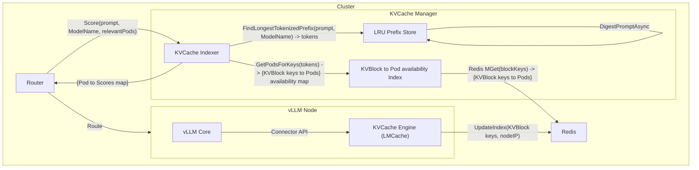
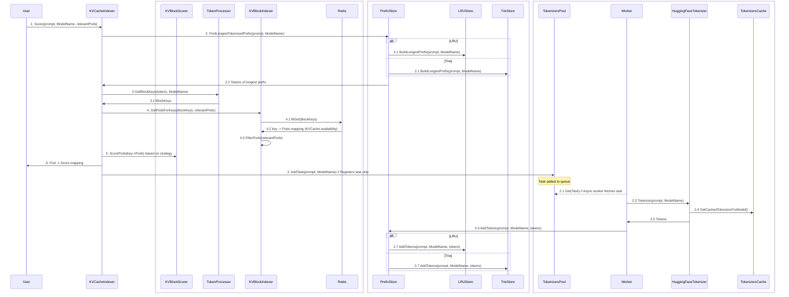

# KVCache Manager

## Introduction

LLM inference can be computationally expensive due to the sequential nature of token generation. 
KV-caching plays a critical role in optimizing this process. By storing previously computed key and value attention vectors, 
KVCache reuse avoids redundant computations during inference, significantly reducing latency and resource consumption. 
This is particularly beneficial for long context multi-turn conversations or Agentic (&RAG) applications where 
previously computed information can be leveraged effectively. 
Efficient KVCache management and routing are essential for scaling LLM inference and delivering a responsive user experience.

llmd-kv-cache-manager is a pluggable KVCache Manager for KVCache Aware Routing in vLLM-based serving platforms.

See the [docs folder in the repository](https://github.com/llm-d/llm-d-kv-cache-manager/blob/main/docs/README.md) for more information on goals, architecture and more.
## Overview

The code defines a [KVCacheIndexer](https://github.com/llm-d/llm-d-kv-cache-manager/tree/main/pkg/kv-cache/indexer.go) module that efficiently maintains a global view of KVCache states and localities. 
In the current state of vLLM, the only available information on KVCache availability is that of the offloaded tensors to KVCache Engines via the Connector API.

The `kvcache.Indexer` module is a pluggable Go package designed for use by orchestrators to enable KVCache-aware scheduling decisions.

This overview greatly simplifies the actual architecture and combines steps across several submodules.

## Architecture 

For even more a detailed architecture, refer to the [architecture](https://github.com/llm-d/llm-d-kv-cache-manager/tree/main/docs/architecture.md) document.

The architecture is designed to efficiently maintain a global view of KVCache states and localities, enabling KVCache-aware scheduling decisions.

### Detailed System Flow

### Explanation
The main blocking sequence of steps that happens when a user (e.g., router) sends a request to the KVCacheIndexer is as follows:
1. **User** sends a request to the **KVCacheIndexer** with a prompt, model name, and relevant pods.
2. **KVCacheIndexer**:
   - Finds the longest tokenized prefix for the prompt and model name using the **PrefixStore**.
      - Depending on the store type (LRU or Trie), it gets the tokenization of the longest cached prefix
   - Adds a tokenization task to the **TokenizersPool**, which is handled asynchronously by a worker. This bit is explained later.
3. **KVCacheIndexer** queries the **TokenProcessor** to get block keys for the tokens of the longest prefix.
4. **TokenProcessor**:
   - Chunks the tokens and generate keys for the token blocks. The chunking and key calculating has to be aligned with
     the source that feeds the key -> pods backend (Redis).
   - Returns the block keys to the **KVCacheIndexer**.
5. **KVCacheIndexer** queries the **KVBlockIndexer** for pods that have the block keys.
   - The **KVBlockIndexer** queries the **Redis** backend for the mappings with MGet.
   - The **Redis** backend efficiently returns the key -> pods mapping.
6. **KVCacheIndexer** uses the configured **KVBlockScorer** to score the pods based block hits:
    - LongestPrefixMatch: scores by the longest consecutive (ordered) block hits in a single pod.
    - HighestBlockHit: scores by the index of the highest block hit in a single pod.
    - CoverageBasedMatching: scores by the total number of block hits in a single pod.

Asynchronous tokenization flow:
1. A worker fetches the task from the **TokenizersPool**.
2. The worker tokenizes the prompt using the **HuggingFaceTokenizer**.
3. The **HuggingFaceTokenizer** retrieves the cached in-memory tokenizer for the model.
    - If the tokenizer is not cached, it gets created and cached.
4. The **HuggingFaceTokenizer** returns the tokens to the worker.
5. The worker adds the tokens to the **PrefixStore**.
    - Depending on the store type (LRU or Trie), it adds the tokens to the appropriate store:
      - LRUStore: an LRU HashTable of prompt-chunks to tokens
      - TrieStore: a Trie of characters to tokens
    - Due to the nature of how tokenizers operate, the tokenization of a prefix of a prompt is a prefix of the tokenization of the full prompt.
        One challenge in tokenization is that different chunks of a prompt map to different tokens.
        Therefore, when we chunk a prompt, we use the [_, end] index associated with the tokens to contain token in a chunk.
        The implication of this design is that the tokens contained in a chunk are only correct if all previous chunks are also considered,
        since one token may be associated with the edge-characters of two consecutive chunks.

### Maintenance of Redis for KVBlock -> Pods Mapping
In the current phase, LMCache is set up to use the same Redis server for indexing. For the scope of LMCache, this indexing
is necessary for KVCache reuse through offloading and sharing.

## Examples

- [KVCache Indexer](https://github.com/llm-d/llm-d-kv-cache-manager/tree/main/examples/kv-cache-index/): 
  - A reference implementation of using the `kvcache.Indexer` module.
- [KVCache Aware Scorer](https://github.com/llm-d/llm-d-kv-cache-manager/tree/main/examples/kv-cache-aware-scorer/): 
  - A reference implementation of integrating the `kvcache.Indexer` module in 
  [llm-d-inference-scheduler](https://github.com/llm-d/llm-d-inference-scheduler) in a KVCache aware scorer.
